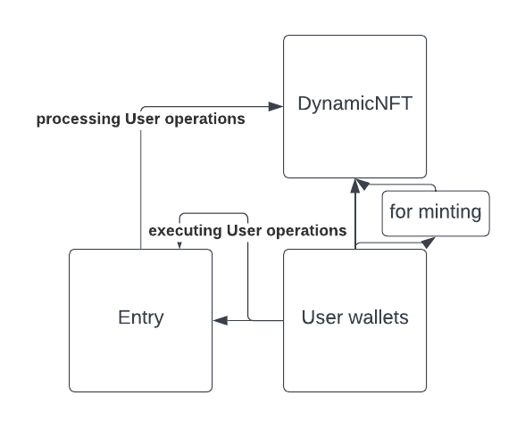

# ERC-4337: Loyalty NFT

## 1. Introduction
   - This technical specification outlines the implementation of ERC-4337, titled "Loyalty NFT" for the DynamicNFT contract. ERC-4337 introduces a mechanism for account abstraction tailored specifically for loyalty NFTs, enhancing user rewards and engagement.

## 2. Authors
   - This proposal is authored by Max Mucientes - Université Paris Dauphine-PSL.

## 3. Motivation
   - The motivation behind ERC-4337 for loyalty NFTs is to enhance user engagement and loyalty by providing dynamic rewards that evolve over time. By abstracting account interactions, users can seamlessly receive rewards and participate in loyalty programs without the need for direct transaction management.

## 4. Specification
   - ERC-4337 introduces the concept of UserOperation tailored for loyalty NFTs. It includes fields such as sender, nonce, reward details, and signature.
   - An EntryPoint contract is introduced to execute bundles of UserOperations specific to loyalty NFTs. Bundlers handle UserOperations to include loyalty rewards in blocks.
   - Account contracts must implement the IAccount interface, which includes methods to validate loyalty rewards and execute them.
   - The specification includes support for semi-abstracted nonce to ensure uniqueness and security in loyalty reward transactions.
   - Loyalty rewards are based on specific criteria, such as users receiving a €1 discount for every 10 kilometers ran.
   - The evolveNFT function is dependent on users being active Strava users, ensuring that rewards evolve based on their running activity.

## 5. Usage Examples
   - Sequential reward issuance: Loyalty rewards are issued sequentially based on user activity and engagement metrics.
   - Tier-based rewards: Users receive different rewards based on their loyalty tier, with higher tiers receiving more valuable rewards.

## 6. Required EntryPoint Contract Functionality
   - The EntryPoint contract must handle UserOperations by performing verification and execution loops specific to loyalty rewards.
   - In the verification loop, it validates UserOperations, checks for user eligibility and loyalty tier, and ensures sufficient reward coverage.
   - In the execution loop, it calls accounts with UserOperation calldata to distribute loyalty rewards, updates user balances, and manages reward tiers.

## 7. Conclusion
   - Implementation of ERC-4337 for loyalty NFTs will enhance user engagement and loyalty by providing dynamic rewards that evolve over time. By following this specification, DynamicNFT can create a seamless loyalty program experience for users while maintaining decentralization and security.

## Architecture Diagram



## Pseudocode

```solidity
// Interface for Account Contract
interface IAccount {
    function validateUserOp(
        PackedUserOperation calldata userOp,
        bytes32 userOpHash,
        uint256 missingAccountFunds
    ) external returns (uint256 validationData);

    function executeUserOp(
        PackedUserOperation calldata userOp,
        bytes32 userOpHash
    ) external;
}

// Interface for EntryPoint Contract
interface IEntryPoint {
    function handleOps(
        PackedUserOperation[] calldata ops,
        address payable beneficiary
    ) external;

    function handleAggregatedOps(
        UserOpsPerAggregator[] calldata opsPerAggregator,
        address payable beneficiary
    ) external;

    function getNonce(address sender, uint192 key) external view returns (uint256 nonce);
}
